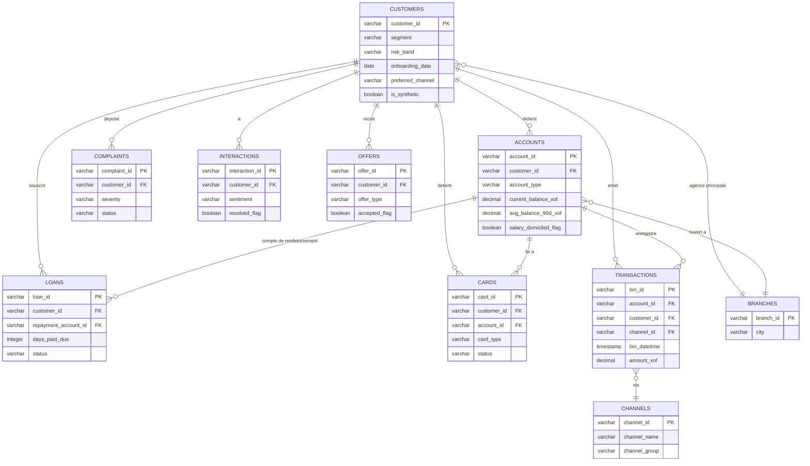

# Diagramme ERD - dataBank CI Customer 360

> *[English version: [erd_diagram_en.md](erd_diagram_en.md)]*

**Auteur :** Ibrahima TRAORÉ - Analytics Engineer
**Date :** Juillet 2026

Ce diagramme couvre le schéma de la couche staging (`dbt_project/models/staging/`),
un modèle par table source, chacun à la grain de sa table brute. `customer_id`
est la clé qui relie tout le portefeuille ; `account_id` et `channel_id` sont
les deux autres clés de jointure utilisées par les modèles intermediate.

## 1. Schéma relationnel

## 2. Grain de chaque table

| Table | Grain | Modèle staging |
|-------|-------|-----------------|
| Customers | 1 ligne / client | `stg_customers.sql` |
| Accounts | 1 ligne / compte (un client peut en avoir plusieurs) | `stg_accounts.sql` |
| Transactions | 1 ligne / transaction | `stg_transactions.sql` |
| Loans | 1 ligne / prêt | `stg_loans.sql` |
| Cards | 1 ligne / carte | `stg_cards.sql` |
| Complaints | 1 ligne / réclamation | `stg_complaints.sql` |
| Interactions | 1 ligne / interaction conseiller | `stg_interactions.sql` |
| Offers | 1 ligne / offre proposée | `stg_offers.sql` |
| Branches | 1 ligne / agence (référentiel, réel uniquement) | `stg_branches.sql` |
| Channels | 1 ligne / canal (référentiel, réel uniquement) | `stg_channels.sql` |

Deux tables (`Branches`, `Channels`) sont des référentiels : elles n'ont pas
de contrepartie synthétique dans `_sources.yml`, contrairement aux 8 autres
qui ont chacune une table `bronze_synthetic_*` fusionnée en Bronze.

## 3. Comment ce schéma devient `customer_360`

Toutes les tables au grain "transaction/compte/prêt" sont agrégées à la
grain client dans `dbt_project/models/intermediate/` (un modèle par concern :
récence, tendance, réclamations, score digital, produits, solde, NBI, canal,
prêts), puis jointes en une seule ligne par client dans
`dbt_project/models/marts/customer_360.sql` - voir `docs/data_dictionary.md`
pour le détail colonne par colonne de ce mart.
