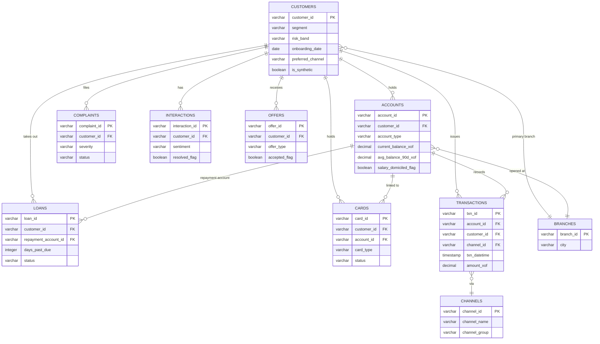

# ERD Diagram — dataBank CI Customer 360

> *[French version: [erd_diagram.md](erd_diagram.md)]*

**Author:** Ibrahima TRAORÉ — Analytics Engineer
**Date:** July 2026

This diagram covers the staging layer schema (`dbt_project/models/staging/`),
one model per source table, each at its raw table's grain. `customer_id` is
the key that ties the whole portfolio together; `account_id` and
`channel_id` are the two other join keys used by the intermediate models.

## 1. Relational schema

## 2. Grain of each table

| Table | Grain | Staging model |
|-------|-------|-----------------|
| Customers | 1 row / customer | `stg_customers.sql` |
| Accounts | 1 row / account (a customer can hold several) | `stg_accounts.sql` |
| Transactions | 1 row / transaction | `stg_transactions.sql` |
| Loans | 1 row / loan | `stg_loans.sql` |
| Cards | 1 row / card | `stg_cards.sql` |
| Complaints | 1 row / complaint | `stg_complaints.sql` |
| Interactions | 1 row / advisor interaction | `stg_interactions.sql` |
| Offers | 1 row / offer made | `stg_offers.sql` |
| Branches | 1 row / branch (reference, real only) | `stg_branches.sql` |
| Channels | 1 row / channel (reference, real only) | `stg_channels.sql` |

Two tables (`Branches`, `Channels`) are reference data: they have no
synthetic counterpart in `_sources.yml`, unlike the other 8 which each have a
`bronze_synthetic_*` table merged at Bronze.

## 3. How this schema becomes `customer_360`

Every table at the "transaction/account/loan" grain is aggregated to the
customer grain in `dbt_project/models/intermediate/` (one model per concern:
recency, trend, complaints, digital score, products, balance, NBI, channel,
loans), then joined into a single row per customer in
`dbt_project/models/marts/customer_360.sql` — see `docs/data_dictionary.md`
for the column-by-column detail of this mart.
