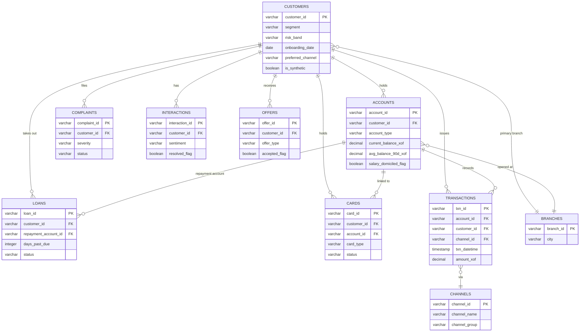

# Data Schema (ERD) - dataBank CI Customer 360

> *[French version: [erd_diagram.md](erd_diagram.md)]*

**Author:** Ibrahima TRAORÉ - Analytics Engineer
**Date:** July 2026

This diagram shows how the 10 source tables relate to each other, at the
"staging" stage (`dbt_project/models/staging/`): one model per source
table, each keeping the same level of detail ("grain") as the original raw
table. `customer_id` is the key that ties the whole customer portfolio
together. `account_id` and `channel_id` are the two other keys used to
link tables together in the "intermediate" models.

## 1. Relational schema

Reading note: `PK` stands for "primary key" (the unique identifier of each
row in the table). `FK` stands for "foreign key" (a column that points to
the identifier of another table, creating the link between the two).

## 2. Level of detail of each table

| Table | Level of detail (one row =) | Matching staging model |
|-------|-------|-----------------|
| Customers | 1 customer | `stg_customers.sql` |
| Accounts | 1 account (a customer can hold several) | `stg_accounts.sql` |
| Transactions | 1 transaction | `stg_transactions.sql` |
| Loans | 1 loan | `stg_loans.sql` |
| Cards | 1 card | `stg_cards.sql` |
| Complaints | 1 complaint | `stg_complaints.sql` |
| Interactions | 1 exchange with an advisor | `stg_interactions.sql` |
| Offers | 1 offer made to a customer | `stg_offers.sql` |
| Branches | 1 branch (fixed reference data, real only) | `stg_branches.sql` |
| Channels | 1 contact channel (fixed reference data, real only) | `stg_channels.sql` |

Two tables (`Branches` and `Channels`) are fixed reference data: they have
no synthetic version in `_sources.yml`, unlike the other 8 tables, which
each have a matching `bronze_synthetic_*` table merged in at the Bronze
stage.

## 3. How this schema becomes the final `customer_360` table

Every table detailed at the "transaction / account / loan" level is first
grouped up to the "customer" level in `dbt_project/models/intermediate/`
(one model per topic: recency, trend, complaints, digital score, products,
balance, generated revenue, channel, loans). These are then combined into
a single row per customer in
`dbt_project/models/marts/customer_360.sql`. Every column of this final
table is explained in `docs/data_dictionary_en.md`.
